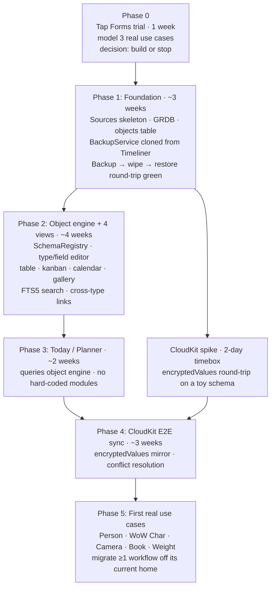

# PurpleLife — Build Plan

## Context

PurpleLife is a native macOS "Life OS": one app for planner, hobbies (WoW, photography), extended contacts, reading log, and weight, organized as configurable object types with relations. Data lives in CloudKit, end-to-end encrypted with keys the user controls, and is mirrored across the user's Macs. Daily restorable backups land in the standard PhantomLives location.

This document supersedes both `PLAN-original.md` (kept as historical context) and the prior diff-style refinement of this file. It is written as a standalone build plan: name reconciled to the directory and Purple* family, conventions from `CLAUDE.md` wired in, encryption locked, layout matched to existing siblings (`Timeliner`, `PurpleTracker`, `WeightTracker`).

## Locked decisions

- **Name** — `PurpleLife`. Matches the directory and the Purple* family naming (PurpleIRC, PurpleDedup, PurpleTracker).
- **Stack** — Swift / SwiftUI, GRDB for SQLite, XcodeGen-managed `project.yml`, `build-app.sh` deriving `CFBundleShortVersionString` from git commit count. Same stack as `Timeliner` and `PurpleTracker`.
- **Sync** — CloudKit. First subproject in PhantomLives to use it (confirmed by grep; budget a spike, see Phases).
- **Encryption** — `CKRecord.encryptedValues`. Apple cannot decrypt; keys live in the user's iCloud Keychain trust circle, not on Apple servers. Custom AES-GCM is rejected for v1: it costs 2–3 weeks for migration custody / rotation / multi-device recovery, breaks CloudKit indexes, and buys little against any realistic threat model. The JSON-blob storage shape (below) keeps a future migration to client-held keys mechanical.
- **Storage shape** — single `objects` table:
  - typed columns: `id`, `type_id`, `parent_id`, `created_at`, `updated_at`
  - encrypted JSON `fields` blob carrying everything else
  - lift specific fields out of JSON to typed columns only when a query is provably slow
  - no SQLCipher: CloudKit's `encryptedValues` covers field encryption in the cloud; on-disk encryption is FileVault's job
  - EAV (entity-attribute-value) is rejected: it punishes both sync and queries
- **Single target** — no `Core` Swift package split. No sibling app uses one, and the iOS app is genuinely a separate project. The JSON-blob storage shape is portable on its own when iOS happens.
- **GRDB, not SwiftData** — SwiftData's compile-time-modeled assumption is the wrong shape for runtime-defined types. Both Timeliner and PurpleTracker already use GRDB.

## Reuse from siblings

Every system service has a sibling implementation to copy from. Default to copy-then-adapt; only diverge with reason.

| Concern | Source file |
|---|---|
| Auto-backup-on-launch (debounce, retention trim, restore-with-safety-backup, listBackups newest-first) | `Timeliner/Sources/Timeliner/Services/BackupService.swift` and `Timeliner/Tests/TimelinerTests/BackupServiceTests*` |
| GRDB pool, support directory layout, schema migrations | `Timeliner/Sources/Timeliner/Services/DatabaseService.swift` |
| Export pipeline (CSV / Markdown / PDF / clipboard) | `Timeliner/Sources/Timeliner/Services/ExportService.swift` |
| `build-app.sh` (git-derived version, /tmp build dir, signing) | `Timeliner/build-app.sh` |
| `project.yml` (XcodeGen, GRDB SPM dep, deployment target macOS 14) | `Timeliner/project.yml` |
| `Sources/<Name>/{App,Models,Services,Views,Resources}` source layout | `PurpleTracker/Sources/PurpleTracker/` |
| Doc set (`README.md`, `CHANGELOG.md`, `USER_MANUAL.md`, `INSTALL.md`, `HANDOFF.md`) | any sibling |

## PhantomLives conventions checklist

All mandated by `CLAUDE.md`. Calling them out explicitly so they don't slip during build phases.

- **Default user-visible output dir** — `~/Downloads/PurpleLife/`. Created on demand. Exports, generated reports, and any other user-facing output land here. User overrides persist (UserDefaults).
- **Auto-backup-on-launch**:
  - Path: `~/Downloads/PurpleLife backup/PurpleLife-YYYY-MM-DD-HHmmss.zip`
  - Contents: zip of `~/Library/Application Support/PurpleLife/` (DB + settings + attachments)
  - Retention: 14 days default (`0` means keep forever)
  - Debounce: skip launch run if previous successful backup is < 5 minutes old
  - Failure mode: `NSLog`, never throw — the app must launch even if backup fails
  - Settings keys: `autoBackupEnabled`, `backupPath`, `backupRetentionDays`, `lastBackupAt`
- **Settings → Backup UI** — toggle for `autoBackupEnabled` (default on), text field + "Choose…" picker for backup directory with resolved path in monospaced caption, retention stepper, "Run backup now" button, "Recent backups" list with Test / Restore (with mandatory pre-restore safety backup) / Reveal in Finder, last-backup timestamp readout.
- **Required backup tests**:
  - `debounce` — second call within 5 min is a no-op
  - `retention trim` — only files matching the `PurpleLife-` prefix in the backup dir are removed when older than the retention window; unrelated files are left alone
  - `target-directory auto-create` — `runBackup` succeeds when the destination directory doesn't exist yet
  - `list ordering` — `listBackups` returns newest-first
- **Internal data still under** `~/Library/Application Support/PurpleLife/` — DB, settings, attachments, logs.
- **Release hygiene every change** — bump version (auto via `build-app.sh` + git commit count), CHANGELOG entry, README + USER_MANUAL update where affected, in-code constants/comments updated, tests added/updated for bug fixes and new behavior, operational files (`project.yml`, `build-app.sh`) updated where relevant.

## Repo structure

```
PurpleLife/
├── README.md
├── CHANGELOG.md
├── USER_MANUAL.md
├── INSTALL.md
├── HANDOFF.md
├── PLAN.md                         # this file
├── PLAN-original.md                # historical context
├── project.yml                     # XcodeGen, GRDB dep, macOS 14
├── build-app.sh                    # cloned from Timeliner
├── run-tests.sh                    # cloned from Timeliner
├── Sources/PurpleLife/
│   ├── App/                        # AppMain, Info.plist, .entitlements (CloudKit)
│   ├── Models/                     # ObjectRecord, ObjectType, FieldDef, Relation, AppSettings
│   ├── Services/
│   │   ├── DatabaseService.swift           # GRDB pool + migrations
│   │   ├── BackupService.swift             # auto-on-launch (Timeliner pattern)
│   │   ├── CloudKitSyncService.swift       # NEW — first in family
│   │   ├── ObjectEngine.swift              # CRUD over the objects table
│   │   ├── SchemaRegistry.swift            # type & field definitions
│   │   ├── ExportService.swift
│   │   └── SearchService.swift             # FTS5 over decrypted blobs
│   ├── Views/
│   │   ├── Today.swift
│   │   ├── Sidebar.swift
│   │   ├── TableView.swift
│   │   ├── KanbanView.swift
│   │   ├── CalendarView.swift
│   │   ├── GalleryView.swift
│   │   ├── Detail.swift
│   │   ├── SchemaEditor.swift
│   │   ├── QuickSwitcher.swift             # ⌘K
│   │   └── Settings/                       # Backup pane lives here
│   └── Resources/
└── Tests/PurpleLifeTests/
    ├── BackupServiceTests.swift            # mirrors Timeliner's
    ├── BackupRoundtripTests.swift          # phase-1 gate
    ├── ObjectEngineTests.swift             # phase-2 gate
    ├── SchemaMigrationTests.swift
    └── CloudKitSyncTests.swift             # phase-4 gate (recorded fixtures)
```

## Design source of truth

The visual design is delivered as `~/Downloads/PurpleLife-handoff.zip` on the user's local machine. Every screen built — Today, Sidebar, TableView, KanbanView, CalendarView, GalleryView, Detail, SchemaEditor, QuickSwitcher, Settings — is implemented from that handoff. Treat it as the spec for layout, typography, color, spacing, and component shape.

Process:

1. Unpack the zip into `PurpleLife/Design/` locally (gitignored if it contains large binaries; commit a manifest of screen names if not committing the assets themselves).
2. Each Views/*.swift implementation references its source screen by filename.
3. Any deliberate deviation from the handoff is recorded in `HANDOFF.md` with a one-line reason.
4. The Phase 2 acceptance gate includes a visual-review check against the handoff.

## Build phases



Realistic budget to "real use": ~3 months of personal-project time. The CloudKit spike runs in parallel with Phase 2 to de-risk Phase 4, since no sibling has used CloudKit before and we have no internal pattern to copy.

## Phase acceptance tests

| Phase | Gate |
|---|---|
| 0 | Tap Forms tried for 1 week against ≥3 real use cases (WoW characters, contacts, weight log). Documented gaps. Decision recorded: build or stop. |
| 1 | Create 100 random objects → force-quit → restart, all present. Backup written to `~/Downloads/PurpleLife backup/`, archive opens, restore into a fresh support dir matches row counts. The four required backup tests (`debounce`, `retention trim` on `PurpleLife-` prefix, `target-directory auto-create`, `list ordering` newest-first) pass. |
| 2 | Define Person, Book, Camera in the schema editor; instances render in table, kanban, calendar, and gallery views; cross-type links work; FTS5 search returns hits across all three types. **Visual review**: each of the four list views and the schema editor matches the corresponding screen in `~/Downloads/PurpleLife-handoff.zip`. |
| 3 | Today view assembles planner items + current weight + currently-reading book by querying the object engine — no hard-coded modules in the view. |
| 4 | A typical edit syncs Mac→Mac in <5 s. Same-field offline edit on both Macs reconciles deterministically on reconnect. CloudKit dashboard shows encrypted fields as opaque blobs. |
| 5 | At least one real life-tracking workflow migrated off its current home and used continuously for ≥2 weeks without falling back. |

## Open questions that genuinely need a decision

- **Scope vs `WeightTracker` and `PurpleTracker`** — `WeightTracker` already owns weight tracking (charts, Smart Import, themes); `PurpleTracker` owns work-tracking. The PurpleLife "Weight" object type can: (a) supersede WeightTracker, (b) coexist and import its CSV, or (c) leave Weight to WeightTracker and only carry an aggregate. Decide before Phase 5. Default if undecided: (b) coexist + CSV import.
- **Search** — SQLite FTS5 over decrypted fields at index time, or skip incremental search for v1? Recommendation: FTS5 from Phase 2; cost is small and Timeliner already uses it.
- **Attachments** — `CKAsset` vs external file refs. Matters for photo libraries (potentially hundreds of MB). Decide before Phase 2 so the object model accommodates either.
- **Schema versioning across synced peers** — user-driven type/field changes need a migration story when peers are on different schema versions. Sketch before Phase 4.

## Out of scope (explicitly)

- iOS app — the JSON-blob storage shape keeps it possible later without a `Core` package split, but the iOS app is a separate project.
- Notarization / public distribution — personal multi-Mac install only; signed local build is sufficient.
- Subsuming `PurpleTracker` — different domain (work matters), different lifecycle.
- Importers from Tap Forms / Anytype / Capacities — manual entry only for v1.
- A decision on whether to build at all — that lives in Phase 0.
